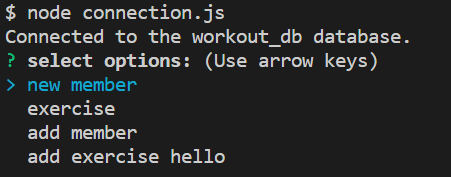
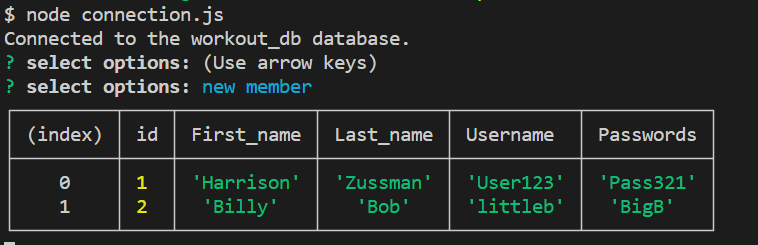
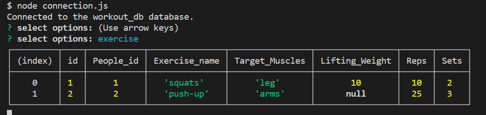
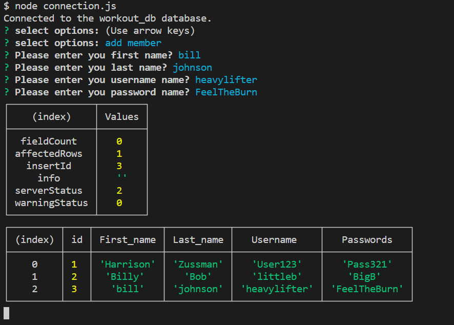
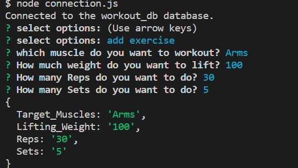

# Workout-Tracker-Project
Project 2 Workout Tracker

## Description
This is the second project for the Rutgers Coding Bootcamp. We are required to create, read, and update the charts. We have to have the users log in and out for the users pre-existing account plus a way for any new people to sign up. When anybody signs up in there account they won't be able to have access to other peoples accounts.

## Screenshot for Charts

## Screenshot for log in screen
![Website Screenshot]